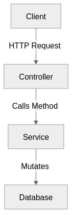
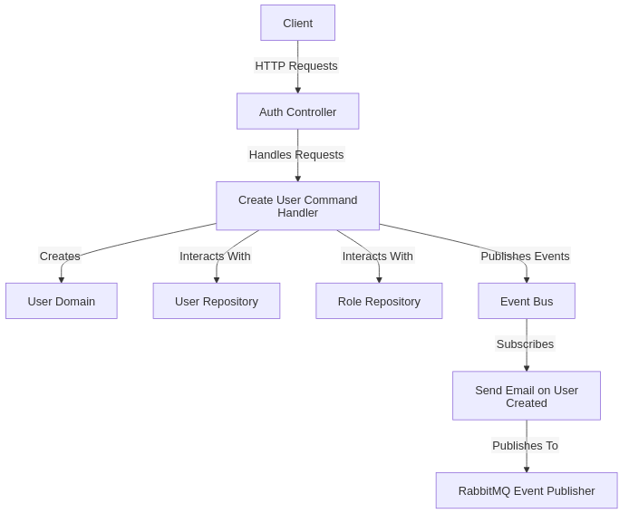

# A Reusable Template for Express.js Projects in the Microservices Architecture

## The architeture

The `/V1` API contains a less complex project, suitable for most Node.js simpler APIs, based on a simple weak layered
architecture, with the service layer treating the business and models logic.

> Register user flow example ignoring the auth/ validation middlewares



The `/V2` API contains a more complex logic, bringing some implementations based on DDD and Clean Architecture.

> Register user flow example ignoring the auth/ validation middlewares



## Eslint

Eslint is configured to order the imports + some default rules that you may want to modify in `.eslintrc.json` :

```javascript
// Disabling the semi collon rule 

module.exports = {
    // ...
    "semi": ["error", "never"] // Just change the rule
// ...
```

## Deploy to an ECS instance


To keep it simple we are connecting both apps to the same db
##### Create a PGSQL RDS instance, there are two main ways of connecting to it :

### Public IP :

- Deploy a public RDS instance and set the
  credentials :```DATABASE_URL = postgres://postgres:password!@${your-rds-endpoint}:5432/${db-name}```

### Using VPC :

- Configure a VPC that allows the ECS instance to connect to the RDS
  instance, [this video](https://www.youtube.com/watch?v=buqBSiEEdQc) can help you with that.

## Run locally

- Run the required infrastructure :
- Copy the data from `env.local` to `.env`

```bash
# Set the DBs up
$ make run-dbs

#Run the broker
$ make run-rabbitmq

$ make run-express

$ make run-dotnet
```
> We are not using the express dockerized image because apparently there is a [issue involving Prisma solving docker dns](https://github.com/prisma/prisma/issues/12598)


